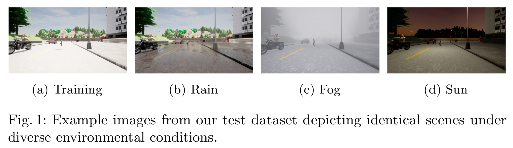

# weather-robustness
Code for the "Evaluating and Increasing Segmentation Robustness in CARLA" paper accepted for WAISE(SAFECOMP 2023) workshop.

Abstract : Model robustness is a crucial property in safety-critical applications such as autonomous driving and medical diagnosis. 
In this paper, we use the CARLA simulation environment to evaluate the robustness of various architectures for semantic segmentation to adverse environmental changes. 
Contrary to previous work, the environmental changes that we test the models against are not applied to existing images, but rendered directly in the simulation, enabling more realistic robustness tests. 
Surprisingly, we find that Transformers provide only slightly increased robustness compared to some CNNs. 
Furthermore, we demonstrate that training on a small set of adverse samples can significantly improve the robustness of most models. 
The code and supplementary results for our experiments are available online.

**Dataset** : The Training and Validation dataset were generated using [CARLA](https://carla.readthedocs.io/en/latest/python_api/) simulator on a clear weather condition at noon(solar angle = 90&deg),
While the test dataset were generated on combinations of different weather intensities(fog & rain) and solar angles.



### Install
The code uses [segmentation-models-pytorch](https://github.com/qubvel/segmentation_models.pytorch) library to construct semantic segmentation models.
The environvent can be replicated by cloning the repository and

```
pip install -r requirements.txt
```

`python training.py`: trains an FPN network with efficientnet-b6 encoder

`python testing.py` : Evaluates the architecture.

`python kp_finetune.py` : Iteratively fine tunes the trained model on the newly generated dataset.

`inference.ipynb` : notebook file containing inference code for the results presented in the paper.


